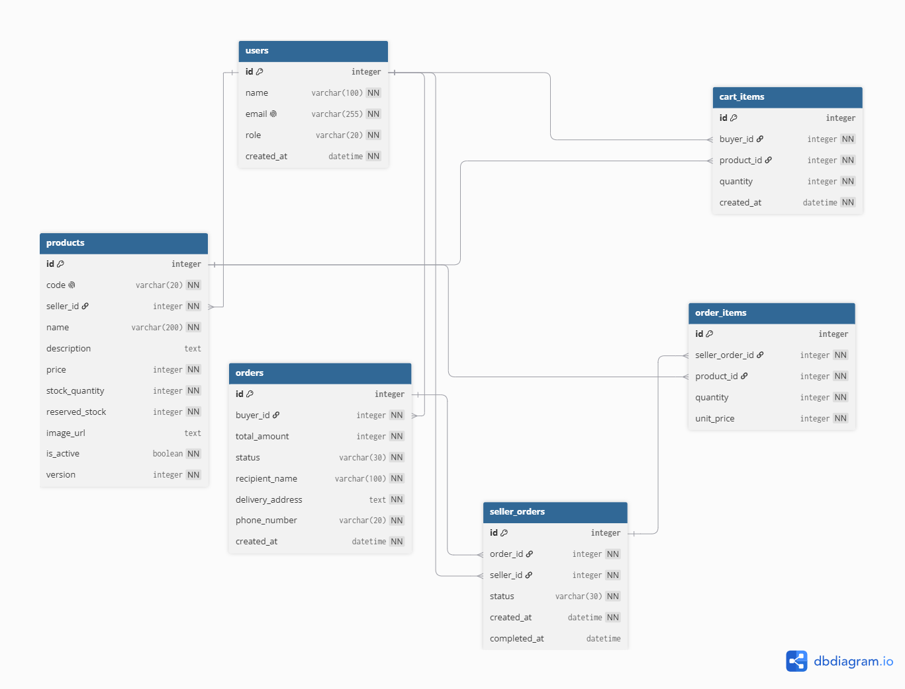

# System Design - Mini Marketplace

This document is the Sprint 2 system design. Each section has an owner issue;
#50 assembles the complete document.

| Section | Content | Issue |
|---|---|---|
| 1. Architecture | C4 container diagram, containers, request flow, what runs today | #43 |
| 2. Data Model | ERD, tables, constraints, transaction rules | #44 |
| 3. API Design | REST contract for the P0 stories | #47 |
| 4. Walking Skeleton | Route, table, query and screenshot of the running page | #50 |
| 5. Architecture Decision Records | ADR-001 and ADR-002 | #43 |
| 6. What Changed Since Milestone 1 | Changes from feedback, review and implementation | #50 |

---

## 1. Architecture

This section describes the system as it runs in Sprint 2: the walking skeleton
that shows real products from the database on the `/products` page. The other
P0 stories are designed in sections 2 and 3 and have no runtime code yet.

### 1.1 Container diagram



The diagram follows the C4 model at container level: each box is an application
or a data store, and the dashed line is the system boundary. Its source is
[`images/mini-marketplace-c4.mmd`](images/mini-marketplace-c4.mmd); after editing
it, render the SVG again with the Mermaid CLI. Version 11.17.0 was used; later
11.x releases need a newer headless Chrome.

```bash
npx -p @mermaid-js/mermaid-cli@11.17.0 mmdc -i docs/images/mini-marketplace-c4.mmd -o docs/images/mini-marketplace-c4.svg
```

### 1.2 Containers

| Container | Technology | Responsibility | Code |
|---|---|---|---|
| Web UI | HTML, CSS and JavaScript running in the browser | Shows the product catalog with loading, empty and error/Retry states | `src/web/pages/products.html`, `src/web/static/` |
| Web/API application | Python, FastAPI, Uvicorn | Serves the page and the `/static` files, exposes the REST API under `/api/v1`, validates requests and queries the database | `src/main.py`, `src/web/router.py`, `src/api/`, `src/config.py`, `src/database.py` |
| Marketplace database | SQLite file (`marketplace.db`, location set by `DATABASE_URL`) | Stores the six relational tables of section 2 (`users`, `products`, `cart_items`, `orders`, `seller_orders`, `order_items`), with foreign keys and CHECK constraints enabled | `src/models/` |
| Database init and seed CLI | Python console commands using SQLModel | `python -m src.seed` creates missing tables and loads 45 sample products, skipping codes that already exist; `python -m src.database` only creates missing tables | `src/seed.py`, `src/database.py` |

The CLI is not a server: a developer or setup tester runs it on demand. The
settings loader, the database session layer and the routers are components
inside the Web/API application, not separate containers.

The application and the CLI both open the SQLite file directly through
SQLModel/SQLAlchemy. There is no database server and no network protocol between
them and the database.

**Database connection layer.** `src/config.py` reads `DATABASE_URL` from the
environment or `.env`. `src/database.py` builds one engine from it, and each
request receives its own session through `SessionDep`. `init_db()` creates
missing tables at start-up and from the CLI. `/health` runs `SELECT 1` and
reports `"database": "connected"` or `"disconnected"`, and a failed catalog
query returns `500` with a generic message. Issue #48 owns this layer and its
error handling.

### 1.3 Request flow for `/products`

1. The browser requests `GET /products`. The application returns
   `products.html` (`src/web/router.py`), and the page loads
   `/static/products.css` and `/static/products.js` from the same server.
2. `products.js` calls `GET /api/v1/products?page=1&limit=20` on the same
   origin, with a 10 second timeout.
3. `list_products()` (`src/api/products.py`) receives a session through
   `SessionDep` and runs two queries on `products`: a `COUNT(*)` and a paged
   `SELECT` filtered on `is_active = TRUE` and ordered by `id`.
4. The API returns `{data, meta}`. The page builds one card per item (name,
   price in VND, stock badge, image with a placeholder fallback).
5. An empty catalog (`data: []`, `meta.total: 0`) shows the empty state. An HTTP
   error, a network failure, the timeout or a malformed response shows the error
   message with Retry. A failed database query returns `500` with a generic
   message, so it is never shown as an empty catalog.

### 1.4 What runs today and what is design only

| Area | Status in Sprint 2 |
|---|---|
| `/products` page, `GET /api/v1/products`, `/health`, the `products` table, the seed and init commands | Implemented and covered by automated tests in `tests/` |
| Six-table schema of section 2 with foreign keys and CHECK constraints | Designed in #44; implemented in #46 (PR #68) with models in `src/models/` and foreign key enforcement enabled in `src/database.py` |
| Product detail, cart, checkout, seller product creation, seller orders | Designed in section 3 (#47); no routes yet |
| Buyer and seller authentication | Design only; nothing is implemented, and `SECRET_KEY` is not read by any code yet |
| Deployment | One local process (`python -m src.main`) and one SQLite file; the page is served by the same process, so there is no separate frontend deployment |

### 1.5 Running catalog API compared with the API contract

`GET /api/v1/products` already follows the path, pagination parameters and
`{data, meta}` shape of section 3. Three details still differ:

| Detail | Section 3 contract | Running code (`src/api/products.py`) |
|---|---|---|
| Product `id` | Internal integer | Returned as a string, for example `"1"` |
| Invalid `page` or `limit` | `400 Bad Request` | `422 Unprocessable Entity`, from FastAPI query validation |
| Error body | `{"error": {"code", "message"}}` | FastAPI's `{"detail": "..."}` |

The API owner (#47) decides whether the code moves to the contract or the
contract records the current behaviour.

---

## 2. Data Model

The Mini Marketplace uses a relational database model to support the P0 buyer and seller workflows defined in Milestone 1.

The data model contains six main tables:

- `users`
- `products`
- `cart_items`
- `orders`
- `seller_orders`
- `order_items`

The current implementation already contains the `products` table through the `Product` SQLModel. The remaining tables define the relational structure required to support cart management, checkout, seller ownership, and seller order management.

---

### 2.1 Entity Relationship Diagram



---

### 2.2 Table Definitions

#### users

**Purpose:** Stores marketplace user accounts. A user may act as a buyer or seller depending on the assigned role.

| Column | Type | Constraints |
|---|---|---|
| `id` | INTEGER | Primary Key |
| `name` | VARCHAR(100) | NOT NULL |
| `email` | VARCHAR(255) | NOT NULL, UNIQUE |
| `role` | VARCHAR(20) | NOT NULL |
| `created_at` | DATETIME | NOT NULL |

The `role` field identifies whether the user is permitted to perform buyer or seller operations.

---

#### products

**Purpose:** Stores products listed by sellers together with their current inventory information.

| Column | Type | Constraints |
|---|---|---|
| `id` | INTEGER | Primary Key |
| `code` | VARCHAR(20) | NOT NULL, UNIQUE |
| `seller_id` | INTEGER | NOT NULL, Foreign Key → `users.id` |
| `name` | VARCHAR(200) | NOT NULL |
| `description` | TEXT | Optional |
| `price` | INTEGER | NOT NULL, CHECK `price > 0` |
| `stock_quantity` | INTEGER | NOT NULL, DEFAULT 0, CHECK `stock_quantity >= 0` |
| `reserved_stock` | INTEGER | NOT NULL, DEFAULT 0, CHECK `reserved_stock >= 0` |
| `image_url` | TEXT | Optional |
| `is_active` | BOOLEAN | NOT NULL, DEFAULT TRUE |
| `version` | INTEGER | NOT NULL, DEFAULT 1, CHECK `version >= 1` |

Additional inventory constraint:

```text
reserved_stock <= stock_quantity
```

Each product belongs to one seller through `seller_id`.

The current implementation already uses these fields in the `Product` SQLModel. The existing `seller_id` field is finalized by this design as a foreign key to `users.id`.

`thumbnail_url` is not stored as a separate database column. The product API can derive the public thumbnail URL from the stored `image_url` value.

---

#### cart_items

**Purpose:** Stores products that a buyer has currently added to their shopping cart.

| Column | Type | Constraints |
|---|---|---|
| `id` | INTEGER | Primary Key |
| `buyer_id` | INTEGER | NOT NULL, Foreign Key → `users.id` |
| `product_id` | INTEGER | NOT NULL, Foreign Key → `products.id` |
| `quantity` | INTEGER | NOT NULL, CHECK `quantity > 0` |
| `created_at` | DATETIME | NOT NULL |

Additional constraint:

```text
UNIQUE(buyer_id, product_id)
```

This constraint prevents the same product from appearing as multiple separate cart lines for the same buyer.

When a buyer adds the same product again, the existing cart item's quantity should be updated rather than creating another cart line.

The cart does not permanently reserve stock. Product availability must be checked again during checkout.

---

#### orders

**Purpose:** Stores the main marketplace order created by a buyer during checkout.

| Column | Type | Constraints |
|---|---|---|
| `id` | INTEGER | Primary Key |
| `buyer_id` | INTEGER | NOT NULL, Foreign Key → `users.id` |
| `total_amount` | INTEGER | NOT NULL, CHECK `total_amount >= 0` |
| `status` | VARCHAR(30) | NOT NULL |
| `recipient_name` | VARCHAR(100) | NOT NULL |
| `delivery_address` | TEXT | NOT NULL |
| `phone_number` | VARCHAR(20) | NOT NULL |
| `created_at` | DATETIME | NOT NULL |

Each order belongs to one buyer.

A marketplace order may contain products from multiple sellers. Therefore, seller-specific fulfillment is represented separately through the `seller_orders` table.

---

#### seller_orders

**Purpose:** Represents the seller-specific part of a marketplace order so that each seller can view and manage only the products belonging to them.

| Column | Type | Constraints |
|---|---|---|
| `id` | INTEGER | Primary Key |
| `order_id` | INTEGER | NOT NULL, Foreign Key → `orders.id` |
| `seller_id` | INTEGER | NOT NULL, Foreign Key → `users.id` |
| `status` | VARCHAR(30) | NOT NULL |
| `created_at` | DATETIME | NOT NULL |
| `completed_at` | DATETIME | NULL; set when status becomes `COMPLETED` |

Additional constraint:

```text
UNIQUE(order_id, seller_id)
```

This ensures that one seller has only one seller-specific order inside a given marketplace order.

The `status` field allows each seller to manage their own fulfillment process independently from other sellers participating in the same buyer order.

The `completed_at` field records when the seller-specific order reaches the `COMPLETED` state. It remains `NULL` while the seller order has not been completed.

For seller analytics, `seller_orders.status` is the canonical fulfillment status. Revenue and best-selling calculations include only seller orders where:

```text
seller_orders.status = COMPLETED
```

The selected analytics period is evaluated using `seller_orders.completed_at`, not the original marketplace order creation timestamp.

---

#### order_items

**Purpose:** Stores individual purchased products belonging to a seller order.

| Column | Type | Constraints |
|---|---|---|
| `id` | INTEGER | Primary Key |
| `seller_order_id` | INTEGER | NOT NULL, Foreign Key → `seller_orders.id` |
| `product_id` | INTEGER | NOT NULL, Foreign Key → `products.id` |
| `quantity` | INTEGER | NOT NULL, CHECK `quantity > 0` |
| `unit_price` | INTEGER | NOT NULL, CHECK `unit_price > 0` |

The `unit_price` field stores the product price at the time of purchase.

This value must be stored separately from the current `products.price` because a seller may change the product price after an order has already been created.

Example:

```text
Product price when ordered: 180,000
Current product price later: 200,000
Stored order_items.unit_price: 180,000
```

Historical orders and seller revenue therefore remain correct even when current product prices change.

---

### 2.3 Relationships and Cardinality

| Relationship | Cardinality | Description |
|---|---|---|
| `users` → `products` | 1 to 0..* | One seller may own zero or many products; each product belongs to one seller |
| `users` → `cart_items` | 1 to 0..* | One buyer may have zero or many cart items |
| `products` → `cart_items` | 1 to 0..* | One product may appear in zero or many buyers' carts |
| `users` → `orders` | 1 to 0..* | One buyer may create zero or many orders |
| `orders` → `seller_orders` | 1 to 1..* | One marketplace order contains one or more seller-specific orders |
| `users` → `seller_orders` | 1 to 0..* | One seller may receive zero or many seller orders |
| `seller_orders` → `order_items` | 1 to 1..* | One seller order contains one or more purchased items |
| `products` → `order_items` | 1 to 0..* | One product may appear in zero or many historical order items |

---

### 2.4 Relationship Summary

The main relationships can be summarized as follows:

```text
users
 ├──< products
 ├──< cart_items
 ├──< orders
 └──< seller_orders

products
 ├──< cart_items
 └──< order_items

orders
 └──< seller_orders

seller_orders
 └──< order_items
```

A buyer creates one marketplace `order`.

If the order contains products from multiple sellers, the order is divided into multiple `seller_orders`.

Example:

```text
Order #100
│
├── Seller Order A
│   ├── Wireless Mouse
│   └── Mechanical Keyboard
│
└── Seller Order B
    └── Laptop Stand
```

This structure allows each seller to view and manage only their own portion of the marketplace order.

---

### 2.5 Business Rule Mapping

Important relational constraints are mapped to the Milestone 1 business rules below.

| Database Constraint / Design Decision | Milestone 1 Rule | Purpose |
|---|---|---|
| `products.price > 0` | BR9 | Prevents zero or negative product prices |
| `products.stock_quantity >= 0` | BR9 | Prevents negative inventory |
| `products.reserved_stock >= 0` | BR9 | Prevents invalid reserved stock |
| `products.reserved_stock <= products.stock_quantity` | BR9 | Ensures reserved stock does not exceed available stock |
| `products.seller_id → users.id` | BR5 | Associates each product with its owning seller |
| `cart_items.quantity > 0` | BR2 | Ensures buyers can only place positive quantities in a cart |
| `UNIQUE(buyer_id, product_id)` | BR2 | Prevents duplicate cart lines for the same buyer and product |
| `orders.buyer_id → users.id` | BR3 / BR4 | Associates an order with the buyer who created it |
| `seller_orders.seller_id → users.id` | BR6 | Supports seller-specific order ownership |
| `UNIQUE(order_id, seller_id)` | BR6 | Creates one seller-specific order per seller inside a marketplace order |
| `order_items.unit_price` | BR7 | Preserves purchase-time prices for historical revenue calculations |
| `order_items.quantity > 0` | BR7 / BR10 | Ensures purchased quantities used in revenue and analytics are valid |
| `seller_orders.status = COMPLETED` | BR7 / BR10 | Ensures revenue and best-selling analytics include only completed seller sales |
| `seller_orders.completed_at` | BR7 / BR10 | Provides the completion timestamp used to filter analytics by selected period |

Some Milestone 1 business rules require application-level or transaction-level validation in addition to database constraints.

---

### 2.6 Transaction-Level Rules

Some business rules cannot be enforced using only static relational constraints.

In particular, stock must be revalidated immediately before an order is created.

The checkout operation should perform the following steps inside one database transaction:

```text
1. Read the buyer's current cart.
2. Re-read the current product inventory.
3. Verify that every requested quantity is still available.
4. Reject checkout if any product is unavailable.
5. Create the marketplace order.
6. Create the required seller orders.
7. Create order items using purchase-time prices.
8. Update product inventory.
9. Commit the transaction.
```

If any step fails, the transaction must roll back so that no partial order or inconsistent stock update remains.

A database transaction alone is not sufficient to prevent overselling when multiple checkout requests update the same product concurrently.

The design uses optimistic concurrency control through `products.version`.

For each product during checkout:

```text
1. Read the latest stock_quantity and version.
2. Verify that the requested quantity is available.
3. Update the product only if its version is still unchanged.
4. Decrease stock and increment version atomically.
5. If no row is updated, another transaction changed the product first;
   reject the checkout and revalidate instead of creating the order.
```

Conceptually:

```sql
UPDATE products
SET stock_quantity = stock_quantity - :quantity,
    version = version + 1
WHERE id = :product_id
  AND version = :expected_version
  AND stock_quantity >= :quantity;
```

If the update affects zero rows, checkout must fail or revalidate.

The inventory update and creation of `orders`, `seller_orders`, and `order_items` remain inside the same transaction. If any step fails, the complete transaction is rolled back.

This strategy supports BR8 by ensuring that the latest inventory is revalidated and updated atomically before order creation.

---

### 2.7 Implementation Consistency Notes

The current `Product` implementation uses an integer primary key.

The implemented product model contains the following database fields:

```text
id
code
seller_id
name
description
price
stock_quantity
reserved_stock
image_url
is_active
version
```

The public product API may expose derived response fields that are not separate database columns.

For example:

```text
thumbnail_url
stock_status
```

`thumbnail_url` can be derived from `image_url`.

`stock_status` can be calculated from `stock_quantity`.

Therefore, these derived API fields do not need to be stored separately in the relational schema.

The current implementation filters the public product catalog using:

```text
is_active = true
```

#### Product visibility terminology

`is_active` is the canonical persistence field used by the current Product model and by this relational design.

Milestone 1 BR1 also describes purchasable products as active.

If earlier API documentation uses `is_published`, it refers to the same catalog-visibility concept. The project should standardize on `is_active` rather than storing both `is_active` and `is_published`.

Therefore, the relational schema contains only:

```text
is_active
```

The ERD and table definitions in this document therefore retain the existing `is_active` field.

The current `seller_id` field exists in the Product model but is not yet implemented as a foreign key. This database design finalizes the intended relationship as:

```text
products.seller_id → users.id
```

The implementation should be updated later to reflect this relationship when the complete user and seller models are introduced.

---

### 2.8 Data Model Summary

The relational model contains six tables:

| Table | Main Responsibility |
|---|---|
| `users` | Stores buyer and seller accounts |
| `products` | Stores seller-owned marketplace products and inventory |
| `cart_items` | Stores products currently selected by buyers |
| `orders` | Stores buyer marketplace orders |
| `seller_orders` | Separates each marketplace order by seller |
| `order_items` | Stores purchased products, quantities, and purchase-time prices |

Together, these tables support the core P0 workflows required by the Mini Marketplace:

```text
Browse products
      ↓
Add products to cart
      ↓
Checkout
      ↓
Create buyer order
      ↓
Split order by seller
      ↓
Store purchased items
      ↓
Seller manages own order
```

The ERD in `docs/images/design_erd.png` must remain consistent with all table definitions, primary keys, foreign keys, and cardinalities documented in this section.

---

## 3. API Design

This section defines the API contract for the P0 user stories in Milestone 1.
All endpoints use the `/api/v1` prefix and return JSON. Unless stated
otherwise, timestamps are ISO 8601 UTC strings.

### 3.1 Product identifiers

Product identifiers have two distinct forms:

- `id` is the internal database primary key. It is an integer and is not used
  in public product URLs.
- `code` is the public product identifier. It is a unique string up to 20
  characters, using the existing catalog format such as `P-100`.

Product detail and cart endpoints use `productCode`/`product_code` and must
resolve the product by `Product.code`. They must not require a UUID. Other
resource identifiers follow the identifier type defined by their own database
model; this contract does not assume that every identifier is a UUID.

### 3.2 Authentication and common response rules

- **Guest (G):** no access token is required.
- **User (U):** requires a valid authenticated buyer or seller access token.
- **Seller (S):** requires a valid authenticated seller token. The seller
  identity is taken from the token, never from a request body.
- Authenticated endpoints use `Authorization: Bearer <access-token>`.
- Successful collection responses use `{ "data": [...], "meta": {...} }`.
- Successful mutation responses return the created or updated resource in
  `{ "data": {...} }`.
- Errors use the common shape:

```json
{
  "error": {
    "code": "ERR_CODE",
    "message": "Human-readable explanation"
  }
}
```

### 3.3 P0 endpoint contract

| Method and path | Access | Input parameters/body | Successful response | Error responses | Relevant P0 story |
|---|---|---|---|---|---|
| `GET /api/v1/products` | G | Query: `page` (positive integer, default `1`), `limit` (1-100, default `20`), optional catalog filters | `200 OK`: paginated product summaries with internal integer `id`, public `code`, `name`, `price`, `image_url`/`thumbnail_url`, `stock_quantity`, and `stock_status` | `400 Bad Request` for invalid pagination/filter values; `500 Internal Server Error` when the catalog cannot be read | US01 Browse product catalog |
| `GET /api/v1/products/{productCode}` | G | Path: `productCode` public product code, for example `P-100` | `200 OK`: one product with `id` (internal integer), `code`, full description, image, price, and current stock status | `404 Not Found` when the product code does not exist or the product is inactive; `422 Unprocessable Entity` when the code is empty or exceeds 20 characters | US02 View product details |
| `GET /api/v1/cart` | U (buyer) | No body; cart is identified by the authenticated buyer | `200 OK`: cart lines containing both the internal integer `product_id` and public string `product_code`, plus names, images, unit prices, quantities, line totals, and `cart_total` | `401 Unauthorized` when the token is missing/invalid; `404 Not Found` when no active cart exists | US03 Cart management |
| `POST /api/v1/cart/items` | U (buyer) | JSON: `{ "product_code": "P-100", "quantity": 1 }` | `201 Created` for a new line, or `200 OK` when an existing line is increased; returns the updated cart | `400 Bad Request` for non-positive/non-integer quantity; `401 Unauthorized`; `404 Not Found` for an unavailable product code; `409 Conflict` when the requested quantity exceeds current stock | US03 Cart management |
| `PATCH /api/v1/cart/items/{productCode}` | U (buyer) | Path: public `productCode`; JSON: `{ "quantity": 2 }` | `200 OK`: updated cart with recalculated line and cart totals | `400 Bad Request` for invalid quantity; `401 Unauthorized`; `404 Not Found` when the cart line/product code does not exist; `409 Conflict` when stock is insufficient | US03 Cart management |
| `DELETE /api/v1/cart/items/{productCode}` | U (buyer) | Path: public `productCode`; no body | `200 OK`: updated cart after removing the line | `401 Unauthorized`; `404 Not Found` when the cart line does not exist | US03 Cart management |
| `POST /api/v1/orders` | U (buyer) | JSON: `{ "recipient_name": "...", "delivery_address": "...", "phone_number": "..." }`; items are read from the authenticated buyer's cart | `201 Created`: order ID, item snapshots, quantities, total, status, and delivery information | `400 Bad Request` for missing/invalid delivery data or an empty cart; `401 Unauthorized`; `409 Conflict` when a product is unavailable or stock changed; `500 Internal Server Error` if the transaction cannot be completed | US04 Checkout and order placement |
| `POST /api/v1/seller/products` | S | Multipart or JSON product body: `name`, `description`, `price`, `stock_quantity`, and `image`; seller comes from the token | `201 Created`: newly created product listing with seller ownership and `is_active` status | `400 Bad Request` for empty name/description or invalid values; `401 Unauthorized`; `403 Forbidden` for a non-seller account; `422 Unprocessable Entity` for malformed fields | US06 Create product listing |
| `GET /api/v1/seller/orders` | S | Query: `status`, `from`, `to`, `page`, and `limit` (default `20`) | `200 OK`: paginated seller orders (`seller_orders` rows) owned by the authenticated seller only, each with its `id` (the `subOrderId`), parent `order_id`, status, and its order items (product, quantity, unit price) | `400 Bad Request` for invalid status/date/pagination; `401 Unauthorized`; `403 Forbidden` for a non-seller account | US08 Seller order management |
| `PATCH /api/v1/seller/orders/{subOrderId}/status` | S | Path: `subOrderId`, the `seller_orders.id` of a seller order owned by the authenticated seller; JSON: `{ "status": "PROCESSING" }` | `200 OK`: updated sub-order status and transition timestamp | `400 Bad Request` with `ERR_INVALID_TRANSITION` for an invalid status transition; `401 Unauthorized`; `403 Forbidden` if the seller order belongs to another seller; `404 Not Found` when the seller order does not exist | US08 Seller order management |

`subOrderId` is `seller_orders.id` from section 2. Fulfilment status is stored per seller order, so a seller changes the status of their whole part of a marketplace order, not of a single order item.

### 3.4 Error handling

The API uses these HTTP status codes consistently:

| Status | Code examples | Condition |
|---|---|---|
| `400 Bad Request` | `ERR_INVALID_QUANTITY`, `ERR_INVALID_TRANSITION` | The request is syntactically valid but violates a business rule, such as quantity `0` or reverting a shipped sub-order to pending. |
| `401 Unauthorized` | `ERR_AUTH_REQUIRED`, `ERR_INVALID_TOKEN` | An authenticated endpoint is called without a valid bearer token. |
| `403 Forbidden` | `ERR_SELLER_REQUIRED`, `ERR_RESOURCE_OWNER` | The identity is authenticated but lacks the required seller role or does not own the requested seller resource. |
| `404 Not Found` | `ERR_PRODUCT_NOT_FOUND`, `ERR_CART_ITEM_NOT_FOUND` | The requested product, cart line, or seller sub-order does not exist or is not visible to the caller. |
| `409 Conflict` | `ERR_STOCK_EXCEEDED`, `ERR_PRODUCT_UNAVAILABLE` | The request conflicts with current inventory or availability, including a checkout race with another purchase. |
| `422 Unprocessable Entity` | `ERR_VALIDATION` | A field has the wrong format or type, such as an invalid product code, phone number, price, or stock quantity. |
| `500 Internal Server Error` | `ERR_DATABASE_FAILURE` | An unexpected database or infrastructure failure prevents the operation from completing. The response must not expose SQL details. |

### 3.5 P0 coverage

The contract covers every P0 story listed in the Milestone 1 requirements:

| Story | Covered endpoints |
|---|---|
| US01 Browse product catalog | `GET /api/v1/products` |
| US02 View product details | `GET /api/v1/products/{productCode}` using public codes such as `P-100` |
| US03 Cart management | `GET`, `POST`, `PATCH`, and `DELETE /api/v1/cart...` |
| US04 Checkout and order placement | `POST /api/v1/orders` |
| US06 Create product listing | `POST /api/v1/seller/products` |
| US08 Seller order management | `GET /api/v1/seller/orders` and `PATCH /api/v1/seller/orders/{subOrderId}/status` |

---

## 4. Walking Skeleton

The Sprint 2 walking skeleton demonstrates an end-to-end slice through all architectural tiers:
**Web UI (browser) → FastAPI application → SQLModel/SQLAlchemy session → SQLite database**.
It proves that the stack can be configured, initialized, seeded, queried, and rendered on any development machine.

### 4.1 Selected Route

The walking skeleton implements the guest-facing product discovery flow (US01):

- **Browser Route:** `GET /products`
  - Served by `src/web/router.py` returning `src/web/pages/products.html`.
  - Dependent assets served statically from `/static`: `products.css`, `products.js`, and `product-placeholder.svg`.
  - The client script (`src/web/static/products.js`) executes in the browser and calls the backend API on the same origin (`/api/v1/products?page=1&limit=20`) using `fetch()` with an explicit 10-second timeout.
- **REST API Route:** `GET /api/v1/products`
  - Defined in `src/api/products.py:list_products()` under the `/api/v1` router prefix.
  - Receives query parameters `page` (default: 1) and `limit` (default: 20, max: 100).
  - Validated by FastAPI/Pydantic (`page >= 1`, `1 <= limit <= 100`), returning `422 Unprocessable Entity` on invalid pagination parameters.
  - Returns a standard envelope containing `data` (list of product summaries) and `meta` (pagination metadata: `current_page`, `limit`, `total`, `total_pages`).
- **Health Verification Routes:** `GET /health` and `GET /api/v1/health`
  - Defined in `src/api/health.py`.
  - Executes `SELECT 1` against the database through `check_db_connection()` to confirm database accessibility.

### 4.2 Database Table Used

The primary persistence entity used by the walking skeleton is the `products` table (`src/models/product.py`), associated with the `users` table (`src/models/user.py`):

- **Table:** `products`
- **Model:** `src.models.product.Product` inheriting from `SQLModel` with `table=True`
- **Schema Columns:**
  - `id`: Integer primary key (`autoincrement=True`).
  - `code`: Unique varchar(20) identifier (e.g., `"P-100"`).
  - `seller_id`: Integer foreign key referencing `users.id` (identifies the owning seller account).
  - `name`: Varchar(200) product title.
  - `description`: Optional text description.
  - `price`: Decimal/float monetary price in VND (constrained by `price > 0`).
  - `stock_quantity`: Integer current stock (constrained by `stock_quantity >= 0`).
  - `reserved_stock`: Integer reserved stock during pending checkout (default `0`, constrained by `reserved_stock >= 0`).
  - `image_url`: Optional text URL or static asset path for product imagery.
  - `is_active`: Boolean catalog visibility flag (default `True`).
  - `version`: Integer optimistic locking counter (default `1`, constrained by `version >= 1`).

### 4.3 Database / SQL Query Used to Retrieve Data

The endpoint `list_products()` in `src/api/products.py` queries the database via an injected SQLModel session (`SessionDep`). It issues two distinct SQL queries:

1. **Total Count Query (Active Products):**
   ```sql
   SELECT COUNT(*) FROM products
   WHERE is_active = TRUE;
   ```
   Computes the total number of catalog-visible records to calculate pagination metadata (`total`, `total_pages = ceil(total / limit)`).

2. **Paged Data Retrieval Query:**
   ```sql
   SELECT id, code, seller_id, name, description, price, stock_quantity, reserved_stock, image_url, is_active, version
   FROM products
   WHERE is_active = TRUE
   ORDER BY id ASC
   LIMIT :limit OFFSET :offset;
   ```
   Where `:offset = (page - 1) * limit`.

**Key Query Characteristics:**
- **Deterministic ordering:** Ordering by `id ASC` ensures pagination stability across successive requests without record duplication or skipping.
- **Business rule enforcement (BR1):** `WHERE is_active = TRUE` guarantees that hidden or inactive items are excluded from both the data slice and the total count.
- **Error boundary isolation:** Database query execution is wrapped in a `try...except SQLAlchemyError` block. If an unexpected database failure occurs, the error is logged server-side with stack trace details, and the API returns `500 Internal Server Error` with a generic message (`"Unable to load products right now. Please try again later."`). It **never** disguises a database error as an empty catalog (`200 OK` with `data: []`).

### 4.4 Confirmation of Database Creation and Seeding

The database setup and seeding process is verified through automated commands and test suites:

- **Database Initialization:**
  - Executed via `python -m src.database` or automatically on application startup via `init_db()` (`src/database.py`).
  - Uses `SQLModel.metadata.create_all(engine)` to create all tables (`users`, `products`, `cart_items`, `orders`, `seller_orders`, `order_items`) if they do not already exist in the SQLite database file (`marketplace.db`).
  - Enables SQLite foreign key constraint enforcement across all sessions via a SQLAlchemy connect listener (`PRAGMA foreign_keys = ON`).

- **Database Seeding:**
  - Executed via `python -m src.seed`.
  - Ensures a default seller user (`id=1`, `email="seller@marketplace.local"`, `role="seller"`) exists.
  - Seeds 45 realistic sample products across multiple categories (electronics, accessories, stationery) with valid prices, positive stock quantities, and `is_active = True`.
  - **Idempotency:** When executed on a fresh database, it reports:
    ```text
    Database tables created or verified.
    Default seller user ready (ID: 1).
    Added: 45 products
    Total products: 45
    Active products: 45
    ```
    When executed again against the same database, it detects existing product codes and inserts zero duplicates:
    ```text
    Database tables created or verified.
    Default seller user ready (ID: 1).
    Added: 0 products
    Total products: 45
    Active products: 45
    ```

- **Verification Evidence:**
  - Verified by automated tests in `tests/test_database.py` and `tests/test_products.py` (46 passing tests).
  - Four independent scenarios verified in `tests/test_issue45_scenarios.py`:
    1. Scenario 1: Display products loaded dynamically from the database.
    2. Scenario 2: At least 10 products available and displayed on default page view (seed provides 45; default page displays 20).
    3. Scenario 3: No hardcoded product arrays in frontend or API code.
    4. Scenario 4: Clean distinction between empty database (`200 OK` with `data: []`) and database error (`500 Internal Server Error`).

### 4.5 Screenshot of the Running Page

The walking skeleton UI running at `http://127.0.0.1:8000/products` displays the seeded products dynamically:


Additional UI states handled by the frontend implementation:
- **Empty State:** When no active products exist in the database, the page displays a clean user-friendly empty banner:
  
- **Error State with Retry:** When the backend API is unreachable or returns a 500 error, the page displays an error notification with a functional Retry action:
  

### 4.6 Environment Configuration (`.env.example`)

The application configuration is managed using `pydantic-settings` (`src/config.py`), reading configuration keys from environment variables or a local `.env` file.

The template `.env.example` provides the following defaults:

```ini
# Application Environment Configuration
# Copy this file to .env and adjust variables as needed:
# cp .env.example .env (Linux/macOS)
# Copy-Item .env.example .env (Windows PowerShell)

APP_NAME="Mini Marketplace"
APP_ENV=development
DEBUG=true
APP_HOST=127.0.0.1
APP_PORT=8000

# Database Configuration (SQLite default for local development and testing)
# In Sprint 2, SQLite database file will be created dynamically at runtime.
DATABASE_URL=sqlite:///./marketplace.db

# Security & CORS settings
# Secret key used for cryptographic signing (minimum 32 characters in production)
SECRET_KEY=dev-secret-key-do-not-use-in-production-environment
CORS_ORIGINS=["http://localhost:3000","http://127.0.0.1:3000","http://localhost:8000","http://127.0.0.1:8000"]
```

**Configuration Fields Explanation:**

| Variable | Default Value | Description |
|---|---|---|
| `APP_NAME` | `"Mini Marketplace"` | Human-readable application title. |
| `APP_ENV` | `development` | Operating environment (`development`, `testing`, `production`). |
| `DEBUG` | `true` | Enables FastAPI auto-reload and verbose error reporting. |
| `APP_HOST` | `127.0.0.1` | Network interface address to bind Uvicorn server. |
| `APP_PORT` | `8000` | Port number on which the HTTP server listens. |
| `DATABASE_URL` | `sqlite:///./marketplace.db` | SQLAlchemy connection string. Defaults to a local SQLite database file in the project root. Can be overridden (e.g. `sqlite:///:memory:` for in-memory testing). |
| `SECRET_KEY` | `dev-secret-key-...` | Secret string for token generation and cryptographic signing (must be overridden in production). |
| `CORS_ORIGINS` | JSON list of origins | Allowed origin headers for Cross-Origin Resource Sharing. |

**Setup Procedure for Fresh Machines:**

```bash
# 1. Copy environment template
cp .env.example .env

# 2. Initialize database and seed sample data
python -m src.seed

# 3. Start development server
python -m uvicorn src.main:app --host 127.0.0.1 --port 8000
```

---

## 5. Architecture Decision Records

### ADR-001: Serve the Sprint 2 web UI and REST API from one FastAPI application

| Field | Decision |
|---|---|
| Status | Accepted, 2026-10-04, after team review in PR #69 |
| Context / problem | Sprint 2 needs a walking skeleton that another team can clone and run on a fresh machine: page → API → database. The team already had a FastAPI application with the product API, and the catalog page needs only one screen of browser JavaScript. |
| Considered options | 1. One FastAPI application serves the HTML/CSS/JS page and the REST API on the same origin. 2. A separate frontend application (for example a React build) deployed next to the API. 3. Replace the stack with a server-side rendering framework. |
| Chosen option | Option 1. FastAPI serves `/products` and `/static`, and the browser calls the API on the same origin. |
| Reasons | A single install and a single start command, which keeps the setup guide short. It reuses the code that already works, needs no Node.js toolchain and no CORS setup for the page, and the web (`src/web`) and API (`src/api`) code still live in separate modules. |
| Consequences | The page and the API are released and deployed together. Frontend routing and state stay simple (vanilla JavaScript, no build step). The module boundary between `src/web` and `src/api` has to be kept by review, not by deployment. |
| Evidence | `create_app()` in `src/main.py` includes the web router and mounts `/static`; `src/web/static/products.js` calls the same-origin API; the page and its states are verified in PR #60 and PR #61 (`docs/traceability.md`, screenshots in `docs/images/issue49-*.png`). |
| Reconsider when | Several screens need shared client-side routing or state and the vanilla JavaScript becomes hard to maintain; the frontend needs its own release cycle; or the team adopts a frontend framework that needs a build step. |

### ADR-002: Use SQLite for the Sprint 2 walking skeleton, accessed through SQLModel

| Field | Decision |
|---|---|
| Status | Accepted, 2026-10-04, after team review in PR #69 |
| Context / problem | Milestone 2 needs a real, persistent database that is created and seeded the same way on every machine, including a fresh machine of another team. The walking skeleton stores one table, `products`; section 2 designs six tables with foreign keys and CHECK constraints, which #46 implements. |
| Considered options | 1. SQLite file. 2. PostgreSQL server. 3. MySQL server. Each is reached through SQLModel/SQLAlchemy and configured with `DATABASE_URL`. |
| Chosen option | Option 1. A SQLite file accessed through SQLModel on SQLAlchemy, with the location set by `DATABASE_URL` (default `sqlite:///./marketplace.db`). |
| Reasons | It is a real database that keeps data between runs. It ships with Python, so setup needs no database server, user or password, which suits local development, demos and the fresh-machine check. Tests use the same engine code with an in-memory database. |
| Consequences | SQLite allows only one writer at a time, so concurrent checkouts and running several application servers have not been tested and may need a server database. SQLite enforces CHECK constraints but not foreign keys: they are off unless each connection runs `PRAGMA foreign_keys = ON`, so the section 2 schema needs that pragma on every connection, for example in a SQLAlchemy `connect` event in `src/database.py`. `init_db()` uses `create_all`, which creates missing tables but never alters existing ones: a `marketplace.db` created before a schema change keeps its old tables. A new column then fails with `no such column`, while a new constraint or foreign key is silently missing, so after a schema change the file has to be deleted and seeded again. |
| Evidence | `Product(SQLModel, table=True)` in `src/models/product.py`; `init_db()` in `src/database.py`; the seed adds 45 products and then none (`tests/test_database.py` runs both commands against a temporary SQLite file); CI run [37206917594](https://github.com/SE-FDA-NEU/G1_AI66A_SE/actions/runs/37206917594) on `8d8e231`: 45 tests passed. SQLite 3.45.1 checks on a test schema that declares the foreign key (an in-memory `users` table and `products.seller_id REFERENCES users(id)`), not on the current `main` table, which has none yet: an orphan `seller_id` was accepted until `PRAGMA foreign_keys = ON` was set and rejected after, and `price = 0` was rejected by a CHECK constraint. A file whose `products` table lacked `seller_id` failed with `no such column: products.seller_id`. A file created by `main` and then opened by the #46 schema code (PR #68) kept its old `products` table and accepted `price = 0` with a NULL `seller_id`. |
| Reconsider when | Tests or demos show write contention errors or miss a non-functional requirement; the system needs more than one application server or a shared central database; a schema change must keep existing data, which needs a migration tool such as Alembic; or a new transaction or deployment requirement cannot be met with a single file. |
| If we change | Changing `DATABASE_URL` alone is not enough: add the database driver, a migration and data transfer step, and retest transactions, the schema, the seed and the test suite. |

---

## 6. What Changed Since Milestone 1

Between the delivery of Milestone 1 and the completion of Sprint 2 (Milestone 2), the team incorporated feedback from the Milestone 1 evaluation, the Sprint 1 Review, and discoveries made during initial implementation. The key architectural and process changes are documented below.

### 6.1 Synchronizing Traceability Matrix Directly with Pull Request Lifecycle

- **Context & Feedback:** During the Sprint 1 Review and Retrospective (`docs/sprint-log.md`), the team identified a recurring divergence: user story specifications, route implementations, and verification evidence in `docs/traceability.md` were lagging behind merged code, leaving the status of routes ambiguous.
- **Change Made:**
  - Established `docs/traceability.md` as the single source of truth for requirements traceability.
  - Instituted an explicit team workflow rule: any Pull Request that introduces, modifies, or completes an API route, web screen, or business rule must update `docs/traceability.md` synchronously before review approval and merge.
  - Added explicit verification evidence blocks in `docs/traceability.md` capturing test runs, CLI reproduction steps, and UI screenshots for every completed milestone task (e.g. Task 3 database API and Task 4 `/products` frontend evidence).
- **Impact:** Eliminates stale documentation, ensures continuous alignment between the project backlog and codebase, and provides traceable audit evidence for milestones.

### 6.2 Transition from In-Memory/Static Mocks to Database-Backed SQLModel Pipeline

- **Context & Feedback:** Milestone 1 defined user stories and initial prototypes with conceptual data representations, but lacked persistent data access, query semantics, or automated database lifecycle controls. Milestone 1 feedback emphasized establishing a functional walking skeleton with real database persistence.
- **Change Made:**
  - Built a centralized database session and engine lifecycle in `src/database.py` utilizing SQLModel and SQLAlchemy with SQLite (`sqlite:///./marketplace.db`).
  - Added automatic table schema generation (`init_db()`) and an idempotent seeding CLI (`src/seed.py`) with 45 structured sample products and a default seller user.
  - Replaced prototype static responses in `GET /api/v1/products` with real SQL queries executing `SELECT COUNT(*)` and paged `SELECT ... LIMIT :limit OFFSET :offset`.
  - Enforced catalog visibility rules at query time (`WHERE is_active = TRUE`) and implemented strict error boundary isolation, ensuring database exceptions return `500 Internal Server Error` and are never misreported as empty catalog results (`200 OK` with `data: []`).
- **Impact:** Delivers a fully working, reproducible walking skeleton that runs identically on local machines, CI environments, and fresh setups without requiring external database servers.

### 6.3 Relational Schema Evolution and Multi-Seller Order Decomposition

- **Context & Feedback:** In early Milestone 1 analysis, orders were conceptualized as simple buyer transactions. During detailed Sprint 2 system design (#44, #46), this model proved inadequate for a multi-vendor marketplace where a single buyer cart may contain products from different sellers, each needing independent fulfillment tracking and isolated order views.
- **Change Made:**
  - Redesigned the relational schema from simple flat orders into a normalized 6-table domain model: `users`, `products`, `cart_items`, `orders`, `seller_orders`, and `order_items`.
  - Introduced the `seller_orders` intermediate entity (`orders` 1 → N `seller_orders` 1 → N `order_items`), establishing a composite relationship where each seller manages only their sub-order partition (`UNIQUE(order_id, seller_id)`).
  - Enforced purchase-time price immutability: `order_items.unit_price` preserves the price at the moment of checkout, guaranteeing that seller revenue calculations (BR7) and best-selling metrics (BR10) remain historically accurate regardless of subsequent product price modifications.
  - Implemented optimistic concurrency control via `products.version` and relational integrity via SQLite foreign key pragma (`PRAGMA foreign_keys = ON`) and column CHECK constraints (`price > 0`, `stock_quantity >= 0`).
- **Impact:** Ensures clean architectural separation of concerns between buyers and sellers, satisfies marketplace business rules (BR5, BR6, BR7, BR9, BR10), and prevents race conditions and overselling during checkout transactions.
