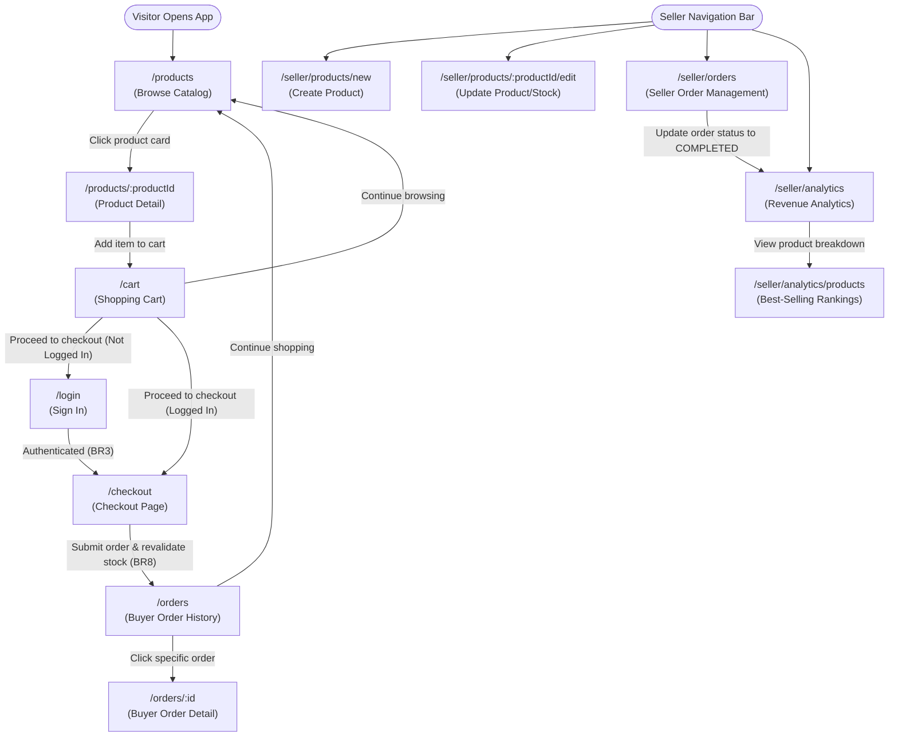

# Requirements Document - Mini Marketplace

**Team:** Team 01 (G1_AI66A_SE)  
**Topic:** Mini Marketplace (Product Discovery, Shopping Cart, Order Management, Seller Analytics)  
**Repository:** [SE-FDA-NEU/G1_AI66A_SE](https://github.com/SE-FDA-NEU/G1_AI66A_SE)  
**Project Board:** [Sprint 1 Board](https://github.com/orgs/SE-FDA-NEU/projects/6/views/1)  

---

## 1. Product Vision

For online buyers needing transparent item availability and independent sellers seeking streamlined store operations, **Mini Marketplace** removes the frustration of inventory overselling, ambiguous checkout errors, and unverified order calculations by providing real-time stock validation, transparent order tracking, and seller revenue analytics, unlike chat-based social seller groups or complex multi-vendor enterprise systems.

---

## 2. Personas

### Persona 1: Nguyễn Minh Anh - University Student & Buyer
* **Role:** Buyer (21 years old, University Student)
* **Goal:** Easily discover products, manage items in a persistent shopping cart, and complete order checkout with clear stock confirmation and order tracking.
* **Blocked by:** Product stock changing between adding items to cart and final checkout; unclear error messages when checkout fails; lack of order confirmation receipts.
* **In her words:** *"Tôi chán nhất là chọn đồ vào giỏ chán chê, bấm thanh toán mới báo lỗi hết hàng hoặc đặt xong không biết đơn đã được ghi nhận chưa."*
* **Technical skill:** Smartphone & laptop daily user, relies on modern web browsers for shopping.
* **Interview note:** Interviewed face-to-face by **Nguyen Thuy Quynh (@Ted Nguyen)** on 10/09/2026 at the NEU campus library.

### Persona 2: Nguyễn Thị Lệ - Online Shop Owner in Móng Cái
* **Role:** Seller (38 years old, Children's Fashion Retailer)
* **Goal:** Swiftly update product information (descriptions, size charts, price) and synchronize inventory levels in real-time across listings to prevent overselling.
* **Blocked by:** Overselling risks due to delayed inventory sync; losing filled form data when a validation error occurs; risk of unauthorized listing modifications by third parties.
* **In her words:** *"Tôi cần cập nhật số lượng tồn kho tức thì khi hàng mới về kho Móng Cái để không bị phạt hủy đơn vì trót bán cho khách món đã hết size."*
* **Technical skill:** Laptop-focused seller managing multi-channel store listings via browser dashboards.
* **Interview note:** Interviewed online via Zoom by **Le Duc Minh (@leducminh290506-eng)** on 18/09/2026.

### Persona 3: Trần Hoàng Nam - Tech Accessories Retailer
* **Role:** Seller (29 years old, Tech Store Owner)
* **Goal:** Access clear sales performance reports and best-selling product rankings to plan inventory replenishment for upcoming months.
* **Blocked by:** Lack of clear sales breakdown per product; analytics that combine uncompleted or cancelled orders into revenue totals.
* **In his words:** *"Tôi muốn biết chính xác sản phẩm nào của cửa hàng bán chạy nhất trong 30 ngày qua để tập trung nhập thêm hàng đó."*
* **Technical skill:** Moderate technical skill, uses browser analytics and Excel spreadsheets.
* **Interview note:** Interviewed via phone by **Nguyen Quang Minh (@QuangMinhQu)** on 15/09/2026.

---

## 3. Scenarios

### Scenario 1 - Nguyễn Minh Anh purchases a children's jacket for her sibling
1. At 8:00 PM, Minh Anh opens the Mini Marketplace web application on her laptop.
2. She browses the product catalog on the main page and filters for children's apparel items.
3. She selects a "Winter Children Jacket" priced at 180,000 ₫ and views its detail page showing 8 units remaining in stock.
4. She selects size 6-years and adds 1 unit of the jacket to her shopping cart.
5. She opens her shopping cart, verifies the subtotal of 180,000 ₫, and proceeds to checkout.
6. On the checkout page, she enters her delivery address in Hanoi and verifies the final total of 200,000 ₫ (180,000 ₫ product + 20,000 ₫ shipping fee).
7. She submits the order, receives an order confirmation with ID #10042 marked as "PENDING", and the jacket's available stock count automatically decreases from 8 to 7 units.

### Scenario 2 - Nguyễn Thị Lệ updates apparel stock and checks store revenue
1. At 9:00 AM, chị Lệ logs into her seller dashboard from her warehouse office in Móng Cái.
2. She navigates to her product list and notices the stock for "Winter Children Jacket" has dropped to 2 units.
3. She opens the product edit page and updates the stock quantity from 2 to 50 units after unloading a new apparel shipment.
4. She checks the incoming seller order table and views 3 newly placed buyer orders marked as "PENDING".
5. She packages order #10042 and updates its status to "COMPLETED".
6. She navigates to the sales analytics tab for September 2026.
7. She confirms the revenue dashboard accurately displays 1,800,000 ₫ generated from 10 completed orders, excluding pending or cancelled orders.

---

## 4. User Stories

### Summary Table

| ID | Story | Priority | Points | Route |
| :--- | :--- | :--- | :--- | :--- |
| **US01** | Browse product catalog | P0 | 3 | `/products` |
| **US02** | View product details | P0 | 2 | `/products/:productId` |
| **US03** | Cart management | P0 | 5 | `/cart` |
| **US04** | Checkout and order placement | P0 | 5 | `/checkout` |
| **US05** | Buyer order history | P1 | 3 | `/orders` |
| **US06** | Create product listing | P0 | 5 | `/seller/products/new` |
| **US07** | Update product info and stock | P1 | 3 | `/seller/products/:productId/edit` |
| **US08** | Seller order management | P0 | 5 | `/seller/orders` |
| **US09** | Seller revenue analytics | P1 | 5 | `/seller/analytics` |
| **US10** | Seller best-selling products | P2 | 3 | `/seller/analytics/products` |

---

### Detailed Stories with Acceptance Criteria

#### US01 - Browse product catalog · P0 · 3 points · Screen: `/products`
As Nguyễn Minh Anh (Buyer), I want to browse products available on the marketplace, so that I can discover items I want to purchase.

* **Acceptance Criteria 1:**
  * **Given** there are 25 active products in the database,
  * **When** the buyer navigates to `/products`,
  * **Then** the product grid displays exactly 20 items per page with pagination showing 2 total pages (BR1).
* **Acceptance Criteria 2:**
  * **Given** no active products exist in the database (`is_published = false` or stock = 0),
  * **When** the buyer opens `/products`,
  * **Then** the product grid is hidden and the exact text "No products available at the moment." is displayed.

---

#### US02 - View product details · P0 · 2 points · Screen: `/products/:productId`
As Nguyễn Minh Anh (Buyer), I want to view detailed product information, price, and stock status, so that I can make an informed buying decision.

* **Acceptance Criteria 1:**
  * **Given** product #101 exists with name "Winter Children Jacket" and price 180,000 ₫,
  * **When** the buyer opens `/products/101`,
  * **Then** the page header displays "Winter Children Jacket" and the price displays exactly "180.000 ₫".
* **Acceptance Criteria 2:**
  * **Given** product #101 has stock = 0,
  * **When** the product page loads,
  * **Then** the stock status badge displays "Out of Stock (0 remaining)" and the "Add to Cart" button is disabled.

---

#### US03 - Add and manage products in shopping cart · P0 · 5 points · Screen: `/cart`
As Nguyễn Minh Anh (Buyer), I want to add items to my cart and adjust quantities, so that I can prepare my purchase order.

* **Acceptance Criteria 1:**
  * **Given** product #101 has a price of 180,000 ₫ and available stock of 10,
  * **When** the buyer changes item quantity from 1 to 3 in `/cart`,
  * **Then** the cart item subtotal updates to exactly "540.000 ₫".
* **Acceptance Criteria 2:**
  * **Given** product #101 has available stock of 2,
  * **When** the buyer attempts to set item quantity to 5,
  * **Then** the action is rejected with the exact error message "Cannot add more than 2 items (available stock limit)" (BR2).

---

#### US04 - Place an order from shopping cart · P0 · 5 points · Screen: `/checkout`
As Nguyễn Minh Anh (Buyer), I want to place an order from my cart, so that I can complete my purchase reliably.

* **Acceptance Criteria 1:**
  * **Given** the cart contains 1 item worth 180,000 ₫ and shipping fee is 20,000 ₫,
  * **When** the buyer submits the checkout form with a valid address,
  * **Then** total order amount displays "200.000 ₫" and order #10042 is created with status "PENDING" (BR3).
* **Acceptance Criteria 2:**
  * **Given** product #101 stock dropped to 0 while the buyer was on the checkout page,
  * **When** the buyer submits the order,
  * **Then** order creation is aborted and an alert shows "Item Winter Children Jacket is out of stock. Please update your cart." (BR8).

---

#### US05 - View buyer order history · P1 · 3 points · Screen: `/orders`
As Nguyễn Minh Anh (Buyer), I want to view my past orders and check their status, so that I can track delivery progress.

* **Acceptance Criteria 1:**
  * **Given** buyer ID #5 has placed 3 past orders (#1001, #1002, #1003),
  * **When** navigating to `/orders`,
  * **Then** exactly 3 order cards are displayed sorted in descending order by creation date.
* **Acceptance Criteria 2:**
  * **Given** buyer ID #5 attempts to open `/orders/9999` belonging to buyer ID #8,
  * **When** the page loads,
  * **Then** access is denied with status 403 and message "You do not have permission to view order #9999" (BR4).

---

#### US06 - Create product listing · P0 · 5 points · Screen: `/seller/products/new`
As Nguyễn Thị Lệ (Seller), I want to create a new product listing with price and stock quantity, so that I can list items for sale.

* **Acceptance Criteria 1:**
  * **Given** a logged-in seller fills out product name "Summer Children Set", price 120,000 ₫, and stock 30,
  * **When** submitting the form on `/seller/products/new`,
  * **Then** product #205 is created with `is_published = true` and stock quantity displays 30 (BR5).
* **Acceptance Criteria 2:**
  * **Given** a seller enters price = -50,000 ₫ in the product creation form,
  * **When** clicking submit,
  * **Then** the form prevents submission with error message "Price must be greater than 0 ₫" (BR9).

---

#### US07 - Update product info and stock · P1 · 3 points · Screen: `/seller/products/:productId/edit`
As Nguyễn Thị Lệ (Seller), I want to update product information and stock levels, so that my store listings remain accurate.

* **Acceptance Criteria 1:**
  * **Given** product #205 currently has stock = 2,
  * **When** seller #1 updates stock quantity to 50 on `/seller/products/205/edit`,
  * **Then** product #205 stock updates to 50 in the database and UI immediately.
* **Acceptance Criteria 2:**
  * **Given** product #205 is owned by seller #1,
  * **When** seller #2 attempts to submit changes via `/seller/products/205/edit`,
  * **Then** update is rejected with message "Unauthorized: You do not own product #205" (BR5, BR9).

---

#### US08 - Seller order management · P0 · 5 points · Screen: `/seller/orders`
As Nguyễn Thị Lệ (Seller), I want to view incoming orders for my products and update fulfillment status, so that I can ship orders quickly.

* **Acceptance Criteria 1:**
  * **Given** seller #1 has received 4 buyer orders,
  * **When** navigating to `/seller/orders`,
  * **Then** exactly 4 orders containing products from seller #1 are listed in the table (BR6).
* **Acceptance Criteria 2:**
  * **Given** order #10042 has status "PENDING",
  * **When** seller #1 clicks "Mark as Completed",
  * **Then** order status changes to "COMPLETED" and the status badge updates within 1 second.

---

#### US09 - Seller revenue analytics · P1 · 5 points · Screen: `/seller/analytics`
As Trần Hoàng Nam (Seller), I want to view total sales revenue metrics for a selected time period, so that I can evaluate business performance.

* **Acceptance Criteria 1:**
  * **Given** seller #1 has 2 COMPLETED orders worth 200,000 ₫ and 300,000 ₫ in September 2026,
  * **When** viewing `/seller/analytics`,
  * **Then** Total Revenue card displays exactly "500.000 ₫" (BR7).
* **Acceptance Criteria 2:**
  * **Given** seller #1 has 1 CANCELLED order worth 150,000 ₫,
  * **When** viewing revenue analytics,
  * **Then** CANCELLED order amount (150,000 ₫) is excluded and total revenue remains "500.000 ₫".

---

#### US10 - Seller best-selling products ranking · P2 · 3 points · Screen: `/seller/analytics/products`
As Trần Hoàng Nam (Seller), I want to see a ranking of my top-selling products by quantity sold, so that I can optimize stock restocking.

* **Acceptance Criteria 1:**
  * **Given** seller #1 sold 50 units of Product A and 20 units of Product B in completed orders,
  * **When** navigating to `/seller/analytics/products`,
  * **Then** Product A is ranked #1 (50 units sold) and Product B is ranked #2 (20 units sold) (BR10).
* **Acceptance Criteria 2:**
  * **Given** date range filter is set to "Last 30 Days",
  * **When** the page loads,
  * **Then** ranking counts include strictly sales records completed within the last 30 days.

---

## 5. Business Rules

| Rule ID | Rule Statement | Worked Example |
| :--- | :--- | :--- |
| **BR1** | Only active and published products with available catalog status can be displayed in the product catalog. | Product #101 is published with 5 units → visible in `/products`. Product #102 has `is_published = false` → excluded from catalog results. |
| **BR2** | Buyers may add or update cart items only when requested quantity is a positive integer (≥ 1) and does not exceed available stock. Adding to cart does not reserve stock. | Buyer requests 3 units of Jacket (stock = 10) → accepted. Buyer requests 5 units (stock = 2) → rejected with error "Cannot add more than 2 items (available stock limit)". |
| **BR3** | A buyer must be authenticated before placing an order at checkout. | Guest user clicks "Checkout" → redirected to `/login`. Authenticated buyer ID #5 clicks "Checkout" → checkout form loads successfully. |
| **BR4** | A buyer can view only their own orders and order detail pages. | Buyer ID #5 opens `/orders/1001` (owned by ID #5) → displayed. Buyer ID #5 attempts `/orders/1002` (owned by ID #8) → HTTP 403 Forbidden "You do not have permission to view order #1002". |
| **BR5** | Sellers may create, view, and modify only products belonging to their own store identity. | Seller #1 edits product #205 (seller_id = 1) → updated. Seller #2 attempts editing product #205 → HTTP 403 Forbidden "Unauthorized: You do not own product #205". |
| **BR6** | Sellers can view and manage incoming orders only if the order contains items from their store. | Order #10042 contains items from Seller #1 → visible in Seller #1's `/seller/orders`. Hidden from Seller #2. |
| **BR7** | Seller revenue is calculated strictly from completed order items belonging to the seller using purchase-time item price. | Seller #1 has 2 COMPLETED order items (200,000 ₫ and 300,000 ₫) and 1 PENDING item (100,000 ₫) → Total Revenue displays 500,000 ₫. |
| **BR8** | Before creating an order, the system must revalidate stock. If stock is insufficient, order creation is aborted and buyer is informed. | Buyer submits order for 2 jackets (stock was 2 at cart page, but reduced to 1 by another buyer) → Order fails with "Item Winter Children Jacket only has 1 unit remaining in stock". |
| **BR9** | Product updates require price > 0 ₫ and stock quantity ≥ 0. Invalid updates abort transaction without changing data. | Seller sets price = 180,000 ₫ and stock = 0 → accepted (Out of Stock). Seller sets price = -10,000 ₫ → rejected with "Price must be greater than 0 ₫". |
| **BR10** | Seller best-selling analytics ranks products strictly owned by the seller by total quantity sold in COMPLETED orders within selected timeframe. | Product A sold 50 units (COMPLETED) and Product B sold 20 units (COMPLETED) → Product A #1, Product B #2. Uncompleted orders (CANCELLED/PENDING) count 0 units. |

---

## 6. Screens and Flow

### Screen Registry

| Route | Purpose | Access | Priority |
| :--- | :--- | :---: | :---: |
| `/products` | Browse product catalog with pagination and filters | **G** | **P0** |
| `/products/:productId` | View product details, price, stock status, and add to cart | **G** | **P0** |
| `/cart` | Manage shopping cart items, update quantities, view subtotal | **U** | **P0** |
| `/checkout` | Enter delivery address, review total fee, place purchase order | **U** | **P0** |
| `/orders` | View buyer order history and delivery status | **U** | **P1** |
| `/orders/:id` | View detailed invoice and status breakdown of a single buyer order | **U** | **P1** |
| `/seller/products/new` | Create a new product listing (name, price, stock) | **U** | **P0** |
| `/seller/products/:productId/edit` | Update seller product details, pricing, and stock quantity | **U** | **P1** |
| `/seller/orders` | View and manage incoming orders, update order status | **U** | **P0** |
| `/seller/analytics` | View total sales revenue analytics dashboard | **U** | **P1** |
| `/seller/analytics/products` | View ranking of top-selling products by quantity sold | **U** | **P2** |

*Access Codes:* **G** = Guest (unauthenticated) · **U** = Authenticated User (Buyer / Seller)

---

### Screen Flow Diagram

