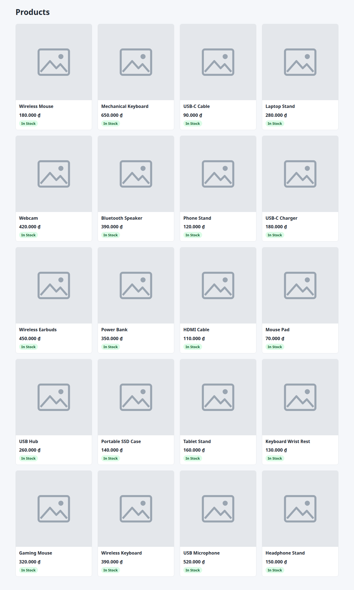
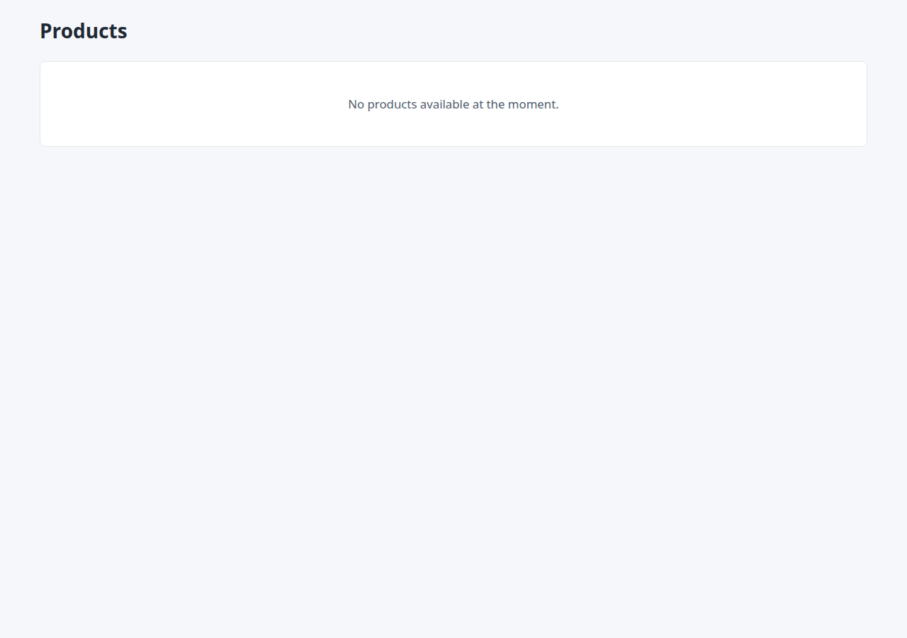
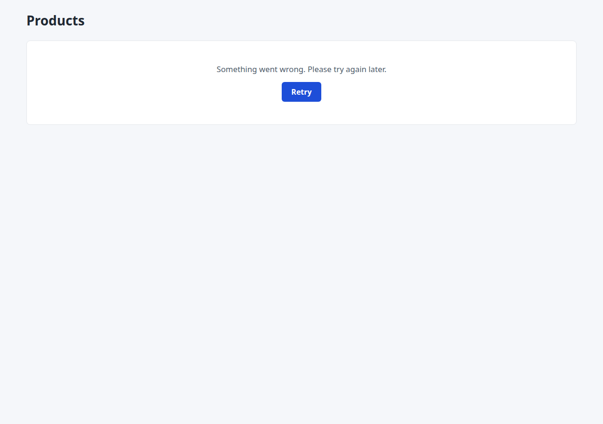

# Traceability

Every screen traces back to a feature and forward to the issue that built it.

This table is the single source of truth for Milestone 1 section 6 and for the
Milestone 4 report. Keep it current - a PR that adds a route and does not
update this file should not be approved.

| Route | Purpose | Access | Priority | Feature | Story issue | PR | Status |
|-------|---------|--------|----------|---------|-------------|-----|--------|
| `/products` | Browse product catalog | G | P0 | F1 Product Discovery | [#13](https://github.com/SE-FDA-NEU/G1_AI66A_SE/issues/13), [#45](https://github.com/SE-FDA-NEU/G1_AI66A_SE/issues/45) | [#24](https://github.com/SE-FDA-NEU/G1_AI66A_SE/pull/24), [#58](https://github.com/SE-FDA-NEU/G1_AI66A_SE/pull/58), [#59](https://github.com/SE-FDA-NEU/G1_AI66A_SE/pull/59), [#60](https://github.com/SE-FDA-NEU/G1_AI66A_SE/pull/60) | In progress |
| `/products/:productId` | View product details | G | P0 | F1 Product Discovery | [#14](https://github.com/SE-FDA-NEU/G1_AI66A_SE/issues/14) | [#35](https://github.com/SE-FDA-NEU/G1_AI66A_SE/pull/35) | Done |
| `/cart` | Manage shopping cart | U | P0 | F2 Cart | #15 | #<PR_NUMBER> | In progress |
| `/checkout` | Place an order | U | P0 | F3 Ordering | #16 | #23 | In progress |
| `/orders` | View buyer orders | U | P1 | F3 Ordering | #17 | #27 | In progress |
| `/orders/:id` | View buyer order details | U | P1 | F3 Ordering | #17 | #27 | In progress |
| `/seller/products` | Manage seller products | U | P0 | F4 Product Management | TBD | TBD | Not started |
| `/seller/products/new` | Create product listing | U | P0 | F4 Product Management | #18 | #28 | In progress |
| `/seller/products/:productId/edit` | Update product information and stock | U | P1 | F4 Product Management | #19 | #30 | In progress |
| `/seller/orders` | Manage incoming orders | U | P0 | F5 Order Management | [#20](https://github.com/SE-FDA-NEU/G1_AI66A_SE/issues/20) | [#26](https://github.com/SE-FDA-NEU/G1_AI66A_SE/pull/26) | In progress |
| `/seller/analytics` | View sales analytics | U | P1 | F6 Analytics | #21 | #33 | In progress |
| `/seller/analytics/products` | View best-selling product ranking | U | P2 | F6 Analytics | #22 | #39 | In review |

**Access codes:** G = guest (not logged in) · U = authenticated user · A = admin

**Status:** Not started / In progress / Done

## Task 3: Database-backed product API

`GET /api/v1/products?page={page}&limit={limit}` is implemented by
`src/api/products.py:list_products()`. It queries the `products` table
(`src/models/product.py`) through the SQLModel session injected as `SessionDep`
(`src/database.py`), returns only active products, and orders them by `id` so
pages are stable. `python -m src.database` creates the table and
`python -m src.seed` loads 45 sample products; running the seed again adds none.

Equivalent SQL for one request:

```sql
SELECT COUNT(*) FROM products WHERE is_active = TRUE;

SELECT * FROM products
WHERE is_active = TRUE
ORDER BY id
LIMIT :limit OFFSET :offset;   -- offset = (page - 1) * limit
```

The internal primary key `id` is an integer; the API returns it as a string,
together with the product `code` (for example `P-100`). `thumbnail_url` and
`image_url` both come from the `image_url` column, and `stock_status` is derived
from `stock_quantity`: `out_of_stock` at 0, `low_stock` up to 5, otherwise
`in_stock`.

| Task 3 requirement | Implementation | Status |
|---|---|---|
| Fetch products from the real database | `list_products()` runs SQLModel `select` queries through `SessionDep` | Done |
| Do not hard-code the product list | Every item in `data` is built from a selected `Product` row | Done |
| Support the defined product-list API contract | Returns `data` and `meta` (`current_page`, `limit`, `total`, `total_pages`); `page < 1`, `limit < 1` or `limit > 100` return `422` | Done |
| Apply catalog visibility rules | Both queries filter on `is_active = TRUE` | Done |
| Keep query failures apart from an empty catalog | A database error is logged on the server and returns `500` with a generic message; an empty table returns `200` with `data: []` and `total: 0` | Done |

### Backend evidence for issue #49

Run on 2026-10-04 against commit `489f187` with a new SQLite database file.
Environment: Ubuntu 24.04 on WSL2, Python 3.12.3, FastAPI 0.142.2,
SQLModel 0.0.22, SQLAlchemy 2.0.54, Uvicorn 0.54.0.

```text
$ python -m src.database
Database initialization completed successfully.
$ python -m src.seed
Added: 45 products
Total products: 45
Active products: 45
$ python -m src.seed
Added: 0 products
Total products: 45
Active products: 45
$ python -m uvicorn src.main:app --host 127.0.0.1 --port 8000
$ curl "http://127.0.0.1:8000/api/v1/products?page=1&limit=20"
```

First item and `meta` of that response:

```json
{"id": "1", "code": "P-100", "name": "Wireless Mouse", "description": "Wireless mouse for study and office work", "price": 180000.0, "thumbnail_url": "/images/p-100.jpg", "image_url": "/images/p-100.jpg", "stock_quantity": 12, "stock_status": "in_stock"}
{"current_page": 1, "limit": 20, "total": 45, "total_pages": 3}
```

| Check | Result |
|---|---|
| Pages 1 to 4 with `limit=20` | 20, 20, 5 and 0 items; 45 distinct codes; `total` 45 and `total_pages` 3 on every page |
| `page=0`, `limit=0`, `limit=101` | `422` |
| `P-100` set to `is_active = 0` | Not in `data`; `total` drops to 44 |
| Name and price of `P-101` changed in the database | The next response shows the new values |
| `products` table renamed, so the query fails | `500` with `{"detail": "Unable to load products right now. Please try again later."}`; the server log shows `Product catalog query failed` with the traceback |
| All rows deleted | `200` with `data: []`, `total: 0`, `total_pages: 0` |

The `/products` browser checks from the frontend evidence below were rerun on
this commit and database (20/20 passed). Screenshots:
[catalog](images/issue49-catalog.png),
[empty state](images/issue49-empty-state.png),
[error with Retry](images/issue49-error-retry.png).
Automated coverage is in `tests/test_products.py` and `tests/test_database.py`
(`pytest`: 22 passed).

## Frontend `/products` evidence

The guest-facing `/products` page is served by the same FastAPI app as the API:
`src/web/router.py` returns `src/web/pages/products.html`, and `src/main.py`
mounts `src/web/static/` at `/static`. Browser behavior lives in
`src/web/static/products.js`, which requests `/api/v1/products?page=1&limit=20`
and renders only `response.data`; it does not contain a hard-coded product
array. The page renders product cards, a loading skeleton, an API error with a
Retry action, and the empty-state message `No products available at the moment.`

| Frontend requirement | Implementation | Evidence |
|---|---|---|
| Display products returned by the backend | `loadProducts()` in `src/web/static/products.js` fetches the first page and builds each card with `createProductCard()` | Browser page at `http://127.0.0.1:8000/products` |
| Display at least 10 records when available | The request asks for `page=1&limit=20`, so the page shows up to 20 products | With the 45 seeded products, the page shows 20 of 45 |
| Display an empty state | `loadProducts()` shows the empty state when `data` is empty and `meta.total` is 0 | An empty `products` table shows the empty-state message |
| Handle loading and API failures | `loadProducts()` shows a loading skeleton; HTTP errors, network failures, a 10 s timeout and malformed payloads show an error with a Retry button | An API `500` shows the error state; Retry reloads the products |

### Evidence for issue #49

Captured on 2026-10-04 against commit `883e9a4` (PR #61), using a new SQLite
database file seeded with `python -m src.seed` (45 active products).
Environment: Ubuntu 24.04 on WSL2, Python 3.12.3, FastAPI 0.142.2,
SQLModel 0.0.22, SQLAlchemy 2.0.54, Uvicorn 0.54.0, headless Chromium 149
driven by Playwright.

| Check | Result |
|---|---|
| Clean seeded database | `GET /api/v1/products?page=1&limit=20` returns `meta.total` 45 and 20 items; the page shows the same 20 names and prices, formatted in VND (`180.000 ₫`) |
| Name and price changed in the test database, page reloaded | The first card shows the new name and price |
| Empty test database (`DELETE FROM products`) | API `200` with `data: []` and `total: 0`; the page shows the empty state without errors |
| API error (`products` table renamed in the test database) | API `500`; the page shows the error message and Retry; after the table is restored, Retry shows the 20 products again |
| Layout at 1280 / 800 / 390 px | 4 / 3 / 2 columns, no horizontal scrolling |







To reproduce:

```bash
python3 -m venv .venv
source .venv/bin/activate
pip install -r requirements.txt
cp .env.example .env    # keep only DATABASE_URL=sqlite:///./marketplace.db
python -m src.seed      # creates the products table and 45 products; a rerun adds none
python -m uvicorn src.main:app --host 127.0.0.1 --port 8000
```

Open http://127.0.0.1:8000/products. Run the edit, empty and error checks on a
disposable copy of the database.

## Business rules

Numbered, so issues and tests can cite them.

| # | Rule | Enforced where | Tested by |
|---|------|----------------|-----------|
| BR1 | Only available products can be displayed in the product catalog. | Product catalog | TBD |
| BR2 | Buyers may add or update cart items only when the requested quantity is a positive integer and does not exceed current available stock. Adding an item to the cart does not reserve stock. | Cart | TBD |
| BR3 | A buyer must be authenticated before placing an order. | Checkout | TBD |
| BR4 | A buyer can view only their own orders. | Orders | TBD |
| BR5 | Sellers may create and manage only products belonging to their own store. Product ownership must be derived from the authenticated seller identity. | Seller product management | TBD |
| BR6 | Sellers can view and manage incoming orders related to their products. | Seller order management | TBD |
| BR7 | Seller revenue is calculated only from the authenticated seller's order items in COMPLETED orders, using the item price recorded at purchase time. | Seller analytics | TBD |
| BR8 | Before creating an order, the system must revalidate product availability and stock using the latest stock data. If stock is insufficient, the order must not be created and the buyer must be informed which item caused the problem. | Checkout/order creation | TBD |
| BR9 | Product updates (price, stock quantity, and product information) must validate that price is strictly positive (> 0) and stock quantity is a non-negative integer (>= 0). If an update fails validation, the database transaction is aborted, and all previous valid data remains unchanged. | Seller product management | TBD |
| BR10 | Seller best-selling product analytics must rank only the authenticated seller's own products using quantities from completed order items in the selected reporting period. | Seller analytics | TBD |
