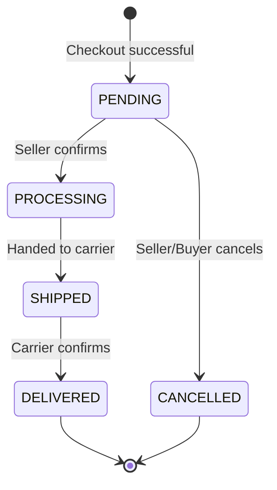

# User Story: Seller Order Management 

## 1. Meta Information
- **Issue ID:** #20 
- **Story:** As a seller, I want to view and update orders containing my products, so that I can process customer purchases.
- **Priority:** P0 
- **Story Points:** 5

---

## 2. Architectural Context: Multi-vendor Cart
**Crucial Note for Devs:** In our system, a buyer can purchase items from multiple sellers in one checkout. 
Therefore, a single parent `Order` contains multiple `Order_Items`. **Sellers manage the status of their specific `Order_Items` (Sub-orders), NOT the parent `Order`.**

---

## 3. Detailed Acceptance Criteria (BDD Format)

**Scenario 1: Viewing relevant sub-orders with pagination & filters**
- **Given** sub-orders containing the seller's products exist
- **When** the seller accesses `/seller/orders`
- **Then** a list of their specific sub-orders is displayed (paginated, 20 per page)
- **And** the seller can filter by `Status` (e.g., PENDING, PROCESSING) and `Date Range`.
- **And** products from other sellers within the same parent order are strictly hidden.

**Scenario 2: Valid status transition**
- **Given** a sub-order is in `PENDING` status
- **When** the seller clicks "Start Processing" (changes status to `PROCESSING`)
- **Then** the database is updated successfully
- **And** the system logs this transition in the `order_history` table (who, when, what).

**Scenario 3: Invalid status transition**
- **Given** a sub-order is already `SHIPPED`
- **When** the seller attempts to revert the status via API to `PENDING`
- **Then** the API rejects the request with HTTP `400 Bad Request`
- **And** returns error code `ERR_INVALID_TRANSITION`
- **And** the UI displays: "Cannot revert a shipped order to pending."

**Scenario 4: Security**
- **Given** an order ID `123` does NOT contain any products from Seller A
- **When** Seller A attempts to view `GET /api/seller/orders/123` or update it via API
- **Then** the system denies access immediately (API returns `403 Forbidden`).

---

## 4. Technical Implementation 

### 4.1. Database Schema PostgreSQL
Need to ensure strict tenant isolation using joins:
```sql
-- Query to fetch orders strictly belonging to the logged-in seller
SELECT 
    oi.id AS sub_order_id,
    o.id AS parent_order_id,
    o.created_at,
    o.shipping_address,
    oi.product_id,
    oi.quantity,
    oi.price,
    oi.status
FROM order_items oi
JOIN orders o ON oi.order_id = o.id
WHERE oi.seller_id = :current_seller_id 
ORDER BY o.created_at DESC;
```

### 4.2. API Contract
**Endpoint 1: View Orders**
- `GET /api/v1/seller/orders?status=PENDING&page=1&limit=20`
- **Response (200 OK):**
```json
{
  "data": [
    {
      "sub_order_id": "item-123",
      "parent_order_id": "ord-123",
      "customer_name": "Nguyễn Minh Anh",
      "product_name": "Mechanical Keyboard",
      "quantity": 1,
      "total_price": 150.00,
      "status": "PENDING",
      "ordered_at": "2026-09-14T10:00:00Z"
    }
  ],
  "meta": { "total": 45, "page": 1, "limit": 20 }
}
```

**Endpoint 2: Update Order Status**
- `PATCH /api/v1/seller/orders/{sub_order_id}/status`
- **Payload:** `{ "new_status": "PROCESSING" }`
- **Response (200 OK):** `{ "message": "Status updated successfully", "current_status": "PROCESSING" }`
- **Response (400 Bad Request):** `{ "error": "ERR_INVALID_TRANSITION", "message": "Transition from SHIPPED to PENDING is not allowed" }`
- **Response (403 Forbidden):** `{ "error": "ERR_FORBIDDEN", "message": "You do not own this order item" }`

### 4.3. Valid Transitions


---

## 5. Non-Functional Requirements (NFRs)
- **Security:** Implement authorization middleware to verify `seller_id` from the JWT token matches the `seller_id` of the `order_item` being updated.
- **Concurrency:** Implement Optimistic Locking (using a `version` column) or Row-level locking (`SELECT FOR UPDATE`) to prevent race conditions if multiple admins of the same shop click update simultaneously.

## 6. Definition of Ready (DoR)
- [x] Multi-vendor logic is defined (Seller updates `order_items`, not `orders`).
- [x] API payload and HTTP codes are documented.
- [x] Security constraints and state machine rules are finalized.